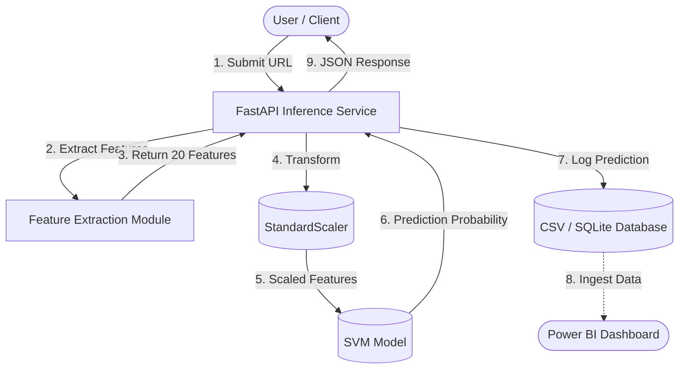

# System Architecture: Phishing URL Detection

This document provides a comprehensive view of the Phishing URL Detection system architecture.

## 1. Architectural Diagram

Below is the logical architecture of the system:

## 2. Component Layers

### 2.1 Client Layer
* **Role**: The end-user or upstream service that sends HTTP POST requests containing the URL to be analyzed.
* **Protocol**: REST over HTTP.

### 2.2 Application / API Layer (`api.py`)
* **Technology**: FastAPI
* **Role**: Serves as the orchestrator. It receives the request, delegates tasks to the sub-modules (feature extraction and modeling), logs the transaction, and returns the response payload.

### 2.3 Feature Engineering Layer (`feature_extraction.py`)
* **Technology**: Python (urllib, re, tldextract)
* **Role**: The core logic layer responsible for breaking down a raw URL string into exactly 20 distinct numerical features categorized into Structure, Domain, Path, Security, and Intent.

### 2.4 Machine Learning Layer (`models/`)
* **Technology**: Scikit-Learn
* **Role**: Responsible for inference. Comprises two serialized artifacts:
  1. `scaler.pkl`: Ensures the incoming features are normalized/scaled identically to the training data.
  2. `best_model.pkl`: The trained Support Vector Machine (SVM) model that calculates the mathematical probability of a URL being phishing.

### 2.5 Data Logging Layer (`predictions_log.csv`)
* **Role**: Acts as the persistence layer. Every API request is appended here in real-time, capturing timestamps, raw URLs, extracted features, and final probability scores.
* **Downstream**: This acts as a data lake for automated ingestion into **Power BI** for continuous monitoring and reporting.
