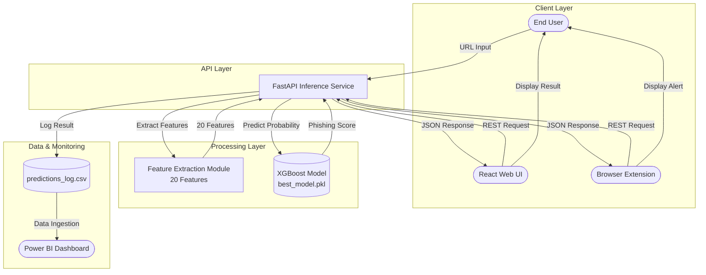

# System Architecture: Phishing URL Detection

This document provides a comprehensive view of the Phishing URL Detection system architecture covering the inference pipeline, deployment options, and data flow.

## 1. System Architecture Overview

Below is the logical architecture of the entire system:


```mermaid
graph TB
    subgraph "Client Layer"
        User([End User])
        WebUI([React Web UI])
        Extension([Browser Extension])
    end
    
    subgraph "API Layer"
        API[FastAPI Inference Service]
    end
    
    subgraph "Processing Layer"
        FE[Feature Extraction Module<br/>20 Features]
        Model[(XGBoost Model<br/>best_model.pkl)]
    end
    
    subgraph "Data & Monitoring"
        CSV[(predictions_log.csv)]
        PowerBI([Power BI Dashboard])
    end
    
    User -->|URL Input| API
    WebUI -->|REST Request| API
    Extension -->|REST Request| API
    
    API -->|Extract Features| FE
    FE -->|20 Features| API
    API -->|Predict Probability| Model
    Model -->|Phishing Score| API
    
    API -->|Log Result| CSV
    CSV -->|Data Ingestion| PowerBI
    API -->|JSON Response| WebUI
    API -->|JSON Response| Extension
    WebUI -->|Display Result| User
    Extension -->|Display Alert| User
```

## 2. Component Architecture

### 2.1 Training Layer (`Training_Pipeline.ipynb`)
* **Role**: The offline research environment where models are built and optimized
* **Process**:
  - Loads raw CSV data (~450k URLs)
  - Extracts 20 features in parallel using ProcessPoolExecutor
  - Trains 4 different classifiers (DT, RF, LR, XGBoost)
  - Performs model comparison and feature importance analysis
  - Optimizes best performer (XGBoost) using RandomizedSearchCV
* **Output**: Serialized `best_model.pkl` saved to `models/` directory

### 2.2 Feature Engineering Layer (`feature_extraction.py`)
* **Technology**: Python (urllib, re, tldextract, concurrent.futures)
* **Role**: Extracts exactly 20 numerical features from raw URLs
* **Key Features**:
  - **extract_features(url)**: Synchronous single-URL feature extraction
  - **extract_features_parallel(urls)**: Batch processing with ProcessPoolExecutor
  - **Parallel Processing**: Leverages all available CPU cores for speed
  - **Feature Categories**: Structural (7), Domain (4), Path/Behavior (5), Security Tricks (3), Intent (1)
* **Performance**: Processes 450k URLs in minutes using parallel workers

### 2.3 API Layer (`API.py`)
* **Technology**: FastAPI with CORS middleware
* **Role**: Production inference server orchestrating predictions
* **Key Features**:
  - **POST /predict** endpoint accepts JSON requests
  - Supports two modes: "fast" (probability only) and "detailed" (includes features)
  - CORS-enabled for cross-origin requests from React frontend
  - Real-time logging to CSV for Power BI integration
* **Workflow**:
  1. Receive URL via HTTP POST
  2. Call feature_extraction.extract_features()
  3. Load pre-trained best_model.pkl
  4. Return probability score (0-100%)
  5. Log prediction with timestamp

### 2.4 Machine Learning Model Layer (`models/`)
* **Technology**: Random Forest (Scikit-Learn)
* **Model Details**:
  - **Algorithm**: Ensemble of Decision Trees (100-300 trees)
  - **Objective**: Binary classification (legitimate vs. phishing)
  - **Decision Strategy**: Majority voting across ensemble
  - **Input**: 20 scaled numerical features
  - **Output**: Phishing probability (0-1, displayed as 0-100%)
* **Why Random Forest for This Task**:
  - URL features are independent (TLD, path structure, keywords don't interact complexly)
  - Clear binary classification boundary - ensemble voting captures patterns without residual refinement
  - Large dataset (450k URLs) benefits from parallel tree construction
  - High recall (catching phishing) naturally achieved through ensemble voting
  - Feature importances directly map to URL threat characteristics
  - Faster inference than sequential boosting models
* **Hyperparameters**: Tuned via RandomizedSearchCV during training

### 2.5 Presentation Layer

#### 2.5.1 React Web UI (`frontend/`)
* **Technology**: React 19 + Vite + Framer Motion
* **Features**:
  - Real-time URL analysis interface
  - Dark/Light theme toggle
  - Mode selector (fast/detailed)
  - Interactive result cards with feature visualization
  - Recharts for data visualization
  - CORS requests to FastAPI backend
  - Responsive design with modern animations

#### 2.5.2 Browser Extension (`phishing-extension/`)
* **Technology**: Chrome/Firefox Extension (Manifest V3)
* **Features**:
  - Real-time detection on any webpage
  - Service worker integration
  - Popup interface for quick analysis
  - Direct API communication with FastAPI backend
  - Visual threat indicators and badges

### 2.6 Data Persistence & Analytics Layer
* **Logging**: CSV-based prediction log (`predictions_log.csv`)
  - Stores: timestamp, URL, probability, all 20 extracted features
  - Updated in real-time with each prediction
* **Downstream**: Direct Power BI integration for:
  - Live phishing trend monitoring
  - Historical analysis
  - False positive/negative tracking
  - Geographic/temporal pattern analysis

## 3. Data Flow Diagram

### Single Prediction Flow
```
User Input (URL)
    ↓
API Receives POST /predict Request
    ↓
Feature Extraction Module
  ├─ Parse URL components
  ├─ Calculate 20 features
  └─ Return feature dictionary
    ↓
Load Pre-trained XGBoost Model
    ↓
Feature Scaling (StandardScaler)
    ↓
Model.predict_proba()
    ↓
Convert to Percentage (0-100%)
    ↓
Parallel Logging to CSV
    ↓
Return JSON Response
    ↓
Client Displays Result (Web UI / Extension)
```

## 4. Technology Stack

| Component | Technology | Purpose |
|-----------|-----------|---------|
| Training | Scikit-Learn, XGBoost, NumPy, Pandas | Model training and evaluation |
| API Server | FastAPI, Uvicorn | Production inference endpoint |
| Feature Engineering | Python stdlib, tldextract, concurrent.futures | URL feature extraction |
| Frontend | React 19, Vite, Framer Motion | User-facing web interface |
| Extensions | JavaScript, Manifest V3 | Browser-based detection |
| Data Persistence | CSV | Predictions logging for BI |
| Analytics | Power BI | Dashboard and monitoring |
| Dependencies | joblib, tqdm, requests | Serialization and utilities |

## 5. Deployment Architecture

### Development Mode
```bash
# Terminal 1: Start FastAPI server
python -m uvicorn API:app --reload

# Terminal 2: Start React dev server (if needed)
cd frontend && npm run dev

# Terminal 3: Train models (if needed)
# Open Training_Pipeline.ipynb in Jupyter
```

### Production Deployment Options
1. **Containerized (Docker)**: FastAPI in container, reverse proxy (Nginx)
2. **Cloud Serverless**: AWS Lambda / Google Cloud Functions
3. **Traditional VM**: FastAPI + Gunicorn on Linux server
4. **Browser Extension**: Deployed to Chrome Web Store / Firefox Add-ons

## 6. Performance Characteristics

- **Single URL Prediction**: <50ms latency
- **Batch Feature Extraction**: ~450k URLs in ~5-10 minutes (CPU-dependent)
- **Concurrent Requests**: FastAPI handles multiple simultaneous predictions
- **Memory**: ~200MB for model + feature extraction
- **CPU**: Utilizes all available cores for parallel processing
