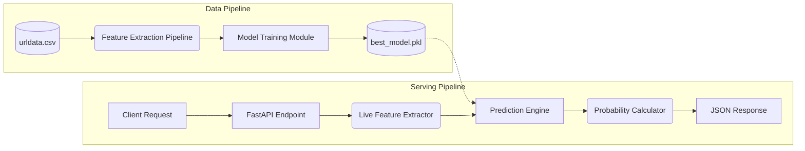

# High-Level Design (HLD): Phishing URL Detection System

## 1. Introduction
The High-Level Design (HLD) document outlines the system architecture and the design overview of the Phishing URL Detection System. This system leverages supervised machine learning to classify incoming URLs, determining the probability that they are malicious.

## 2. System Scope
The system handles:
1. **Model Training (Offline)**: Processing a historical dataset of ~450k URLs, extracting specific attributes, and fitting predictive ML algorithms (SVM, RF, DT, LR).
2. **Inference (Online)**: A real-time web API that accepts live URLs, extracts their structural/domain properties dynamically, and returns a probabilistic risk score.
3. **Analytics (Logging)**: Real-time generation of CSV logs configured for BI dashboard ingestion.

## 3. Component Diagram

## 4. Technology Stack
* **Language**: Python 3.8+
* **Machine Learning**: Scikit-learn (SVM, Random Forest, Decision Tree, Logistic Regression)
* **Data Processing**: Pandas, NumPy
* **Feature Extraction**: `tldextract`, `urllib`
* **API Framework**: FastAPI, Uvicorn
* **Data Visualization (Evaluation)**: Matplotlib, Seaborn
* **Business Intelligence (External)**: Power BI

## 5. Non-Functional Requirements
1. **Performance**: Feature extraction and inference must complete in < 500ms per URL.
2. **Explainability**: The system must not merely output "Phishing/Legitimate" but provide a probability spectrum.
3. **Modularity**: Model training and inference must be strictly decoupled.
